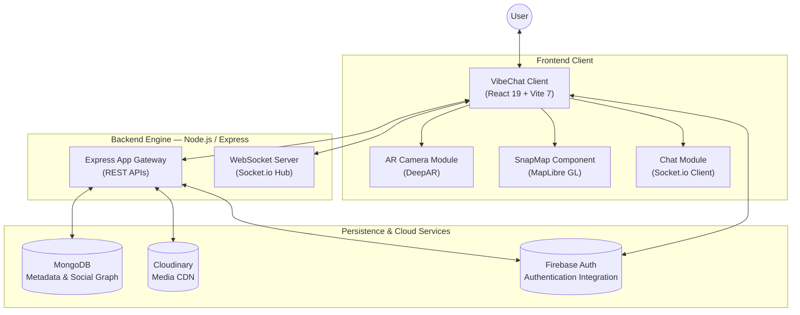
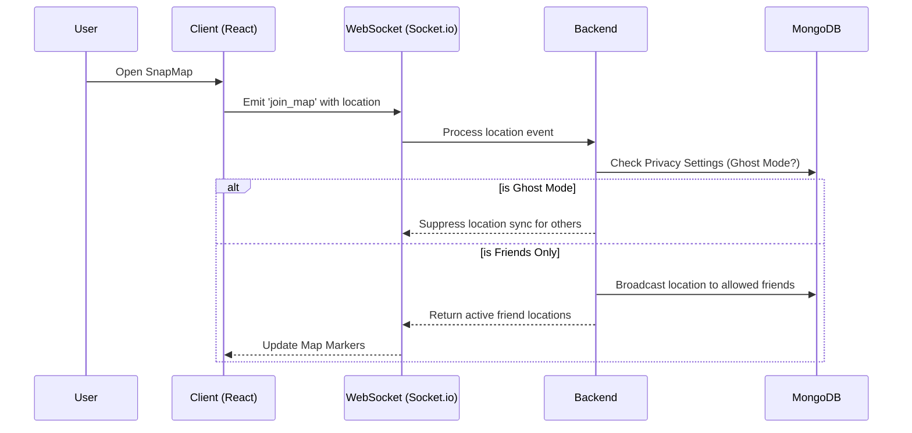
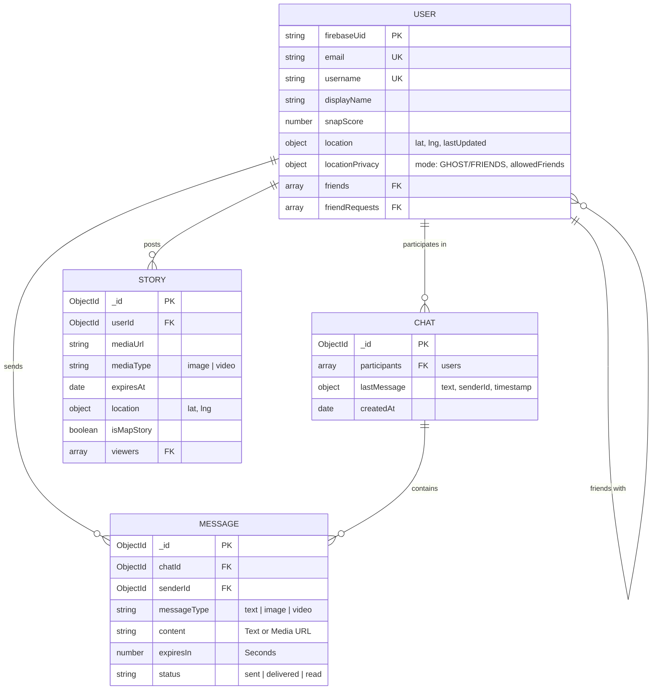

# 👻 VibeChat — Real-Time Social Ecosystem

[](https://opensource.org/licenses/ISC)
[](https://reactjs.org/)
[](https://nodejs.org/)
[](https://socket.io/)
[](https://tailwindcss.com/)

**VibeChat** is a real-time, interactive social platform inspired by Snapchat. It empowers users to connect seamlessly through ephemeral messaging, share everyday moments via location-based Stories, apply Augmented Reality (AR) camera filters, and see what friends are up to in real-time on the SnapMap. 

---

## 🌟 Key Features

| Area | Feature |
| :--- | :--- |
| 🗺️ **SnapMap** | Live, real-time location sharing rendered via **MapLibre-GL** and **React-Map-GL**.  Includes clustering and custom map markers. |
| 📸 **AR Camera Filters** | Advanced facial recognition and augmented reality lenses powered by **DeepAR**. |
| ⚡ **Real-Time Chat** | Instant messaging capabilities with live online status and typing indicators pushed via **Socket.io**. |
| 🛡️ **Ghost Mode & Privacy** | Granular location privacy settings (Ghost Mode, Allowed Friends) integrated into user profiles. |
| ⏳ **Disappearing Messages** | Ephemeral communication where messages optionally expire and disappear over time. |
| 🎬 **Location Stories** | Share images or videos (stored via **Cloudinary**) as temporal "Stories" on the map or in the social feed. |
| 👤 **Friend Ecosystem** | Comprehensive friend management system (add, remove, pending requests, and friend lists). |

---

## 🏗️ System Architecture

### High-Level Components



### Real-Time Map & Ghost Mode Flow



---

## 🛠️ Tech Stack

### Frontend — `client`

| Category | Technology |
| :--- | :--- |
| Framework | React 19.2 |
| Bundler | Vite 7.3 |
| Styling | Tailwind CSS 4.2 |
| AR Features | DeepAR (Web) |
| Mapping | MapLibre GL, React-Map-GL |
| State/Routing | React Router DOM 7 |
| Animations | Framer Motion 12 |
| Authentication | Firebase Client 12 |
| Real-Time | Socket.io-client 4.8 |
| Media Capture | html2canvas, react-rnd |

### Backend — `server`

| Category | Technology |
| :--- | :--- |
| Runtime | Node.js (CommonJS) |
| Framework | Express 5.2 |
| Database ORM | Mongoose 9.2 |
| Auth Admin | Firebase Admin 13 |
| Real-Time | Socket.io 4.8 |
| Media Storage | Cloudinary |
| File Uploads | Multer |
| Server Tooling | Nodemon, dotenv |

---

## 🗺️ Entity Relationship Diagram



---

## 📂 Project Structure

```text
VibeChat/
├── client/                           # React 19 + Vite Frontend Application
│   ├── src/
│   │   ├── assets/                   # Static images, icons, and media
│   │   ├── components/               # Reusable Modular Components
│   │   │   ├── camera/               #   DeepAR Camera, PhotoPreview, FilterCarousel
│   │   │   ├── chat/                 #   ChatRoom, ChatList, ChatLayout
│   │   │   ├── effects/              #   Custom VFX (e.g., BirthdayEffects)
│   │   │   └── layout/               #   Navigation and structural styling
│   │   ├── context/                  # React Context Providers (Auth, Socket)
│   │   ├── pages/                    # Main route views
│   │   │   ├── Home.jsx              #   Main Camera Feed
│   │   │   ├── SnapMap.jsx           #   Interactive MapLibre view
│   │   │   ├── Chat.jsx              #   Messaging Dashboard
│   │   │   ├── Friends.jsx           #   Friend Directory & Requests
│   │   │   ├── Profile.jsx           #   User Settings & Ghost Mode Toggle
│   │   │   └── Login.jsx             #   Firebase Auth Gateway
│   │   ├── services/                 # External API integrations
│   │   ├── utils/                    # Helper functions & formatting utilities
│   │   ├── App.jsx                   # Central React Router setup
│   │   └── main.jsx                  # Application Entry Point
│   ├── index.html
│   ├── package.json
│   └── vite.config.js
│
├── server/                           # Node.js + Express Backend Server
│   ├── controllers/                  # Logic for API endpoints
│   │   ├── chat.js                   #   Message persistence and history
│   │   └── friend.js                 #   Friend request & user search logic
│   ├── models/                       # Mongoose Database Schemas
│   │   ├── Chat.js
│   │   ├── Message.js
│   │   ├── Story.js
│   │   └── User.js
│   ├── routes/                       # Express routing definitions
│   │   ├── auth.js                   #   /api/auth endpoints
│   │   ├── chat.js                   #   /api/chat API handler
│   │   ├── friend.js                 #   /api/friend workflows
│   │   ├── map.js                    #   /api/map location services
│   │   └── upload.js                 #   /api/upload to Cloudinary via Multer
│   ├── package.json
│   ├── server.js                     # Express application bootstrap & API linking
│   └── sockets.js                    # Socket.io Hub & WebSocket handlers
│
└── README.md                         # Project Documentation
```

---

## 🚀 Getting Started

### Prerequisites

| Requirement | Details |
| :--- | :--- |
| **Node.js** | v18+ |
| **MongoDB** | Atlas Cluster or Local Instance |
| **Firebase** | Project with Authentication Enabled |
| **Cloudinary**| Account for media image/video uploads |
| **DeepAR** | Developer API Key |

### 1. Clone the Repository

```bash
git clone https://github.com/swapniljadhav08/VibeChat.git
cd VibeChat
```

### 2. Backend Setup (`server`)

```bash
cd server

# Install dependencies
npm install

# Create environment configuration
# Ensure the following keys exist in your `.env` file:
# PORT=5000
# MONGODB_URI=<your-mongodb-url>
# CLOUDINARY_CLOUD_NAME=<your-cloud-name>
# CLOUDINARY_API_KEY=<your-api-key>
# CLOUDINARY_API_SECRET=<your-api-secret>
# FIREBASE_PROJECT_ID=<your-firebase-project-id>

# Run in development mode
npm run dev
```

### 3. Frontend Setup (`client`)

```bash
cd ../client

# Install frontend dependencies
npm install

# Define frontend variables
# Create a `.env` with Vite variables:
# VITE_API_URL=http://localhost:5000
# VITE_FIREBASE_API_KEY=<your-firebase-key>
# VITE_DEEPAR_KEY=<your-deepar-key>
# VITE_MAPTILER_KEY=<your-map-provider-key>

# Start up the Vite development server
npm run dev
```

> **Client:** runs natively by default on **http://localhost:5173**   
> **Server:** spins up by default on **http://localhost:5000** 

---

## 🌐 Socket.io Event Triggers

VibeChat's instantaneous nature thrives on bidirectional WebSockets:
- `join_map` / `update_location`: Broadcasts user GPS coords if Ghost Mode is disabled.
- `send_message`: Propagates ephemeral texts/media URLs inside real-time chat rooms.
- `typing_start` / `typing_stop`: UI indicators for active conversational engagement.
- `story_upload`: Publishes a temporal Story alert notifying allowed friends online.

---

## 📄 License

This project is licensed under the **ISC License**.
